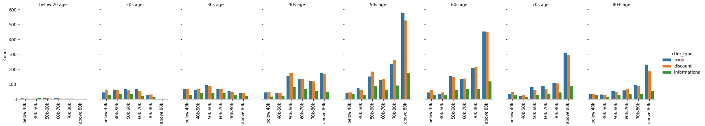
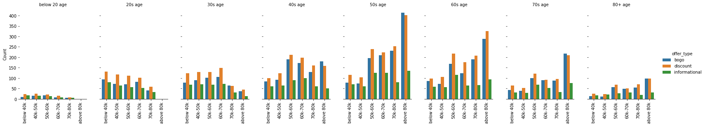
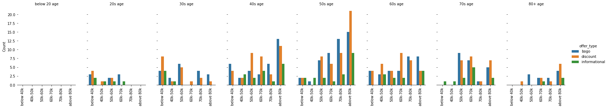

# Starbucks Capstone Challenge

## Introduction

This project is to find out what is the best offer that can be given to a Starbucks customer.

The data set contains simulated data that mimics customer behavior on the Starbucks rewards mobile app. Once every few days, Starbucks sends out an offer to users of the mobile app. An offer can be merely an advertisement for a drink or an actual offer such as a discount or BOGO (buy one get one free). Some users might not receive any offer during certain weeks.

Objective of the project is to combine transaction, demographic and offer data to determine which demographic groups respond best to which offer type. Not all users receive the same offer, and that is the challenge to solve with this data set.

Some users might make a purchase through the app without having received an offer or seen an offer. So the approach here is to first find the users who have received an offer and viewed it, and then find users who have completed that offer within the validity period of that offer. This gives the actual dataset of users who have influenced by Starbucks offers and responded to it. We can analyse this data to find out which type of offers can be given to which group of users. Also creates a machine learning model to predict the offer type that can be given to a demographic group.

## Files

* The data is contained in three files:
    * portfolio.json - containing offer ids and meta data about each offer (duration, type, etc.)
    * profile.json - demographic data for each customer
    * transcript.json - records for transactions, offers received, offers viewed, and offers completed
  
* Starbucks_Capstone_notebook.ipynb - Jupyter Notebook which contains all the script for this project
* requirements.txt - list of python libraries to be installed
* images - folder containing output images

## Python Libraries 

Libraries used are listed in 'requiremts.txt' file. Run the command 'pip install -r requiremts.txt' in command line to install them.

## Results

Offer type preferred by customers based on their age and income:

#### Female users:

#### Male users:

#### Other users:

A detailed write-up is given [here](https://medium.com/@induvkrishna/analysis-of-startbucks-offers-746d54cc31c9).
